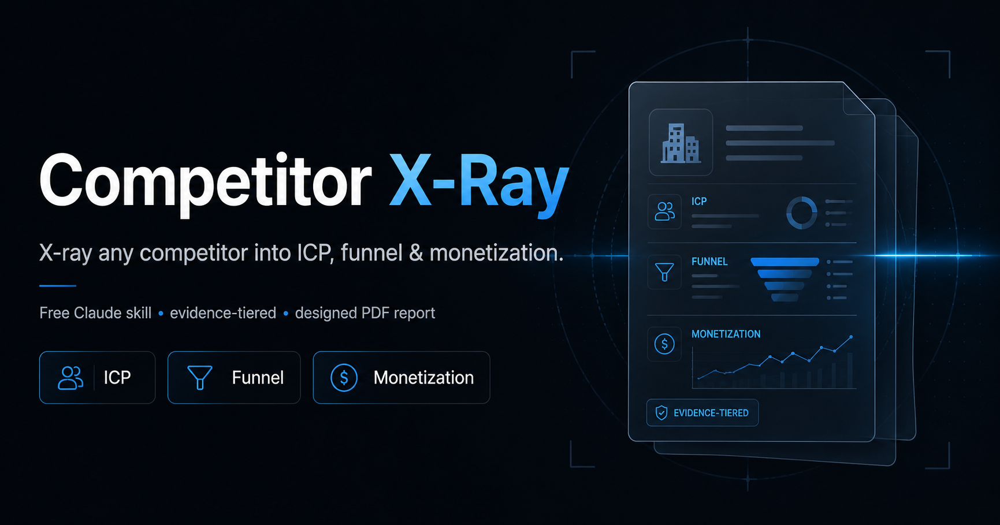

# Competitor X-Ray 🔎

**A free Claude skill from [Mahan AI](https://instagram.com/mahanaicoach).**

Hand it a list of competitors — Instagram/TikTok/X/LinkedIn handles, company names, or website URLs — and it decodes each one into the three things that actually matter:

- **ICP** — who they really sell to (audience vs. paying customer)
- **Funnel** — how a stranger becomes a customer, stage by stage
- **Monetization** — every revenue stream, with price points

Then it zooms out into a **cross-competitor threat ranking** so you can see who to actually worry about.

It runs one research agent per competitor in parallel, verifies every claim against real sources, layers in a **quantitative snapshot** (followers, traffic, growth, funding), and can deliver the result as a chat summary, a spreadsheet, a Word doc, or a **branded, designed PDF report**.

> 👋 Built and given away by **Mahan AI**. If this is useful, follow [@mahanaicoach](https://instagram.com/mahanaicoach) for more AI + automation builds.

---

## ⚡ Quick start (60 seconds)

1. **Download** [`competitor-x-ray.skill`](competitor-x-ray.skill) from this repo. *(Click the file → the **Download** button.)*
2. **Open it** in the Claude desktop app (Cowork) and click **Save skill**.
3. In any chat, just say:

```
research these competitors for me: @sabrina_ramonov @thedankoe gregisenberg
```

That's it — you don't even have to name the skill. Claude picks it up automatically.

Using **Claude Code** instead? See [INSTALL.md](INSTALL.md) for the folder-copy method.

📖 **Want the deep dive?** [GUIDE.md](GUIDE.md) explains exactly how it works and how to get the most out of it.

---

## What makes it different

Most "competitor research" is vibes. This skill holds a quality bar:

- **Audience ≠ customer.** It separates the people who follow someone from the people who pay them — usually the single most useful insight.
- **Three evidence tiers.** Every claim is tagged **CONFIRMED** (seen on an owned page), **REPORTED** (self-reported / third-party estimate, unaudited), or **INFERRED** (a reasoned guess). Self-reported revenue never gets passed off as fact.
- **Real numbers.** A quantitative layer pulls followers/growth (Social Blade, HypeAuditor), and for companies: funding/headcount/G2/traffic.
- **Gated profiles don't stop it.** A concrete fallback chain pulls facts from owned sites, link-in-bio hubs, communities, podcasts, and analytics when Instagram/LinkedIn are login-walled.
- **It never fabricates.** "Not found" is reported as "not found," not invented.
- **Presentation matters.** The designed-PDF output looks like a real intelligence brief, not a wall of text.

---

## Usage examples

Just describe what you want and paste the targets — you don't need to name the skill:

```
research these competitors for me: @sabrina_ramonov @thedankoe gregisenberg
```

```
break down bonusly and nectar — ICP, funnel, and how they make money, with the numbers
```

```
reverse-engineer this creator's funnel: instagram.com/<handle>
```

The skill will ask which output format you want (designed PDF, chat, spreadsheet, or Word doc), research each target in parallel, and deliver.

---

## What you get

For **each competitor**:

- ICP (audience + buyer), pain points
- Funnel mapped top → middle → bottom
- Every monetization stream with prices
- A quantitative snapshot (sourced + dated, evidence-tiered)
- A **links directory** — their site, socials, podcast, community, store
- A confidence note

Plus a **synthesis**: shared patterns, where they diverge, a threat ranking by maturity × momentum, and the single sharpest takeaway.

---

## How it works

```
targets → normalize (handle / company / URL)
        → ask output format
        → fan out: one research agent per competitor (parallel)
        → quantitative layer + evidence tiers
        → synthesize threat ranking
        → render in the chosen format
```

The research standard each agent follows lives in [`competitor-x-ray/references/research-prompt.md`](competitor-x-ray/references/research-prompt.md). Output templates are in [`competitor-x-ray/references/output-formats.md`](competitor-x-ray/references/output-formats.md), and the designed-PDF system is in [`competitor-x-ray/references/designed-pdf.md`](competitor-x-ray/references/designed-pdf.md).

---

## Repo contents

| Path | What it is |
|---|---|
| [`competitor-x-ray.skill`](competitor-x-ray.skill) | The packaged skill — download this to install in Cowork |
| [`competitor-x-ray/SKILL.md`](competitor-x-ray/SKILL.md) | The skill's brain: the full step-by-step instructions Claude follows |
| [`competitor-x-ray/references/`](competitor-x-ray/references/) | Research-agent prompt, output templates, and the designed-PDF system |
| [`competitor-x-ray/evals/evals.json`](competitor-x-ray/evals/evals.json) | Test cases proving the skill works on real targets |
| [`INSTALL.md`](INSTALL.md) | Detailed install for both Cowork and Claude Code |

---

## Optional dependency

The **designed PDF** output renders with [WeasyPrint](https://weasyprint.org/):

```bash
pip install weasyprint
```

Everything else (chat summary, spreadsheet, Word doc) works without it.

---

## Limitations & honesty

- Without a logged-in browser, follower/engagement numbers for gated profiles may be estimates (tagged **REPORTED**).
- Exact website traffic is usually an order-of-magnitude range unless you have a paid SEO data source.
- It tells you what it couldn't verify instead of guessing — by design.

---

## License

MIT — see [LICENSE](LICENSE). Use it, fork it, ship it.

---

<div align="center">

**Made by Mahan AI** · Follow for more AI + automation builds → [@mahanaicoach](https://instagram.com/mahanaicoach)

</div>
